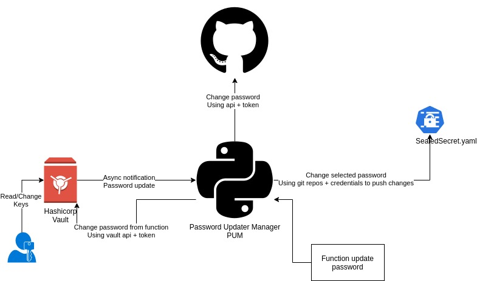

# infrastructure_pum
Contains the Password Update Manager (PUM) which will maintain and update the passwords between github, Hashicorp Vault and SealedSecrets

In order to debug the app locally execute the next command:

python3 -m pip install --user virtualenv && python3 -m venv env && source env/bin/activate && pip install -r requirements.txt

python main.py

PUM:
Based on different functions:

Syncronization between Hashicorp Vault + SealedSecrets + Github

Auto password generator to update the old ones

Sources:
https://geekflare.com/password-generator-python-code/